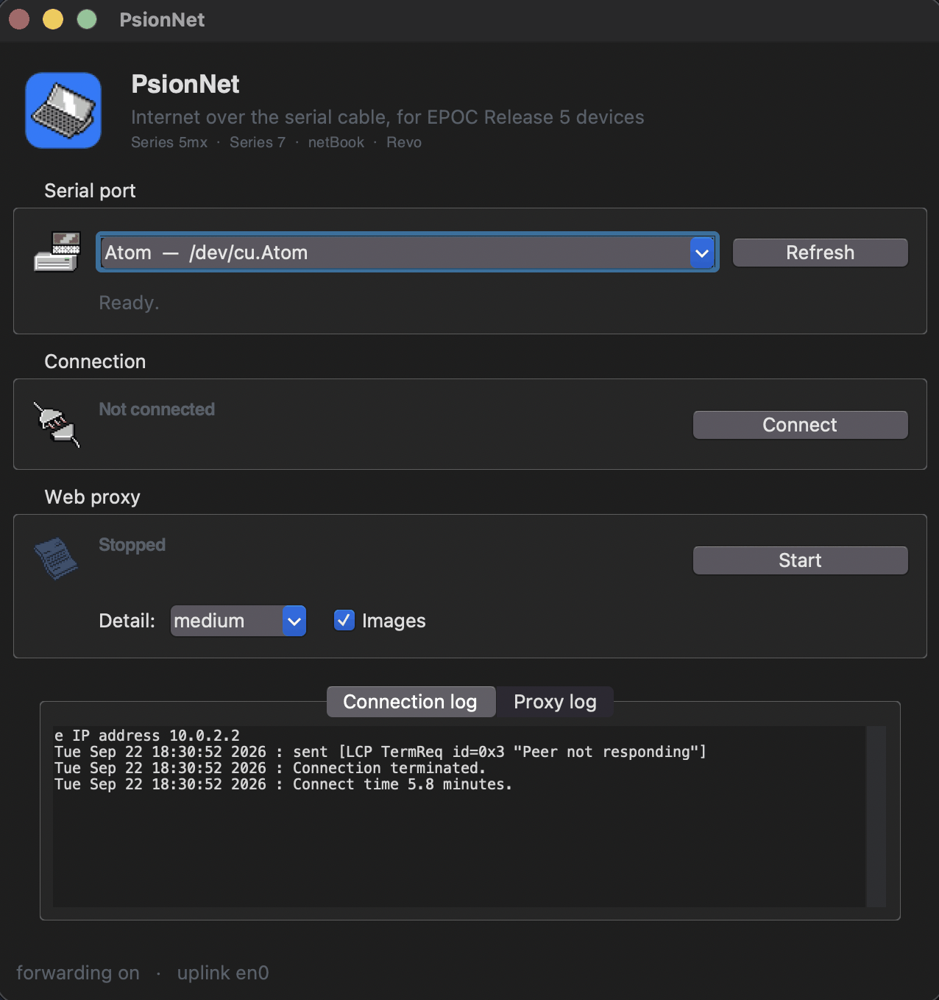

# PsionNet

Put a **Psion** on the modern internet from a Mac, over the serial cable or,
for the netBook Pro, over your network.

PsionNet does two things. It brings up a PPP link over RS-232 so the Psion gets
a real IP address and routes through your Mac, and it runs a proxy that
terminates modern TLS and rewrites pages into something the device's browser
can actually parse. A netBook Pro with a network card needs no link at all:
the proxy listens on the Mac's own network address instead.

It supports three quite different browsers: the **EPOC** handhelds' ROM
browser, which needs HTML 3.2; the **netBook Pro** on Windows CE, with Pocket
Internet Explorer; and the netBook Pro running **PsionLX**, Psion's own Linux,
with Firefox 1.0. The proxy detects which is asking and shapes its output to
suit.

For the netBook Pro running PsionLX it is also a **Spotify speaker**. A Spotify
app on the netBook Pro browses your library and plays it, with PsionNet doing
the part a 2005 machine cannot: talking to Spotify. See
[Spotify on the netBook Pro](#spotify-on-the-netbook-pro-psionlx).

And it is PsionLX's **software library**: Psion's TASKS screen offered "Find
new software" in 2005 and never implemented it. Now it installs programs,
games and fonts from the RetroTechCollection archive, which PsionNet fetches
over the HTTPS the netBook Pro cannot speak. See
[Software for PsionLX](#software-for-psionlx).

Everything ships as one macOS app. No terminal required.

<p align="center">
  
</p>

> **Status:** works, and used in anger. The link, the proxy and the app are all
> verified end to end on real hardware, on both a Series 7 and a netBook Pro
> (Windows CE, dial-up).
>
> **Spotify on the netBook Pro works on the real machine** (4 October 2026),
> over network mode. Still untried on hardware: browsing with PsionLX's
> Firefox through the proxy, and Windows CE over the network; see
> [What has been tested](#what-has-been-tested).

---

## Why this needs to exist

EPOC Release 5 shipped a complete TCP/IP and PPP stack, so a Psion from 1999
can still get online. The networking was never the problem; the web was.

The ROM browser has **no SSL at all**. The string `https` does not appear once
in the entire 16 MB ROM, so there is no scheme handler to fix and nothing to
negotiate. It has no CSS engine, no JavaScript, no PNG decoder, no gzip, and an
ISO-8859-1 character set. In 2026 that means essentially nothing on the public
web will load.

The proxy does the TLS on the Mac and hands the Psion plain HTTP that it can
render, so an unmodified machine browses the real internet.

## What you need

**Hardware**

* A Psion running **EPOC Release 5**: Series 5mx, Series 7, netBook, or Revo.
  (The Series 5 *classic* runs ER3 and is not covered.)
* Or a **Psion netBook Pro**, which runs Windows CE 4.2 .NET rather than EPOC.
  It connects over the same serial cable, but as **dial-up to an emulated
  modem** rather than a direct link. Pick it in the app's Device menu.
* Or a **netBook Pro on your network**, running Windows CE or PsionLX, with a
  network card (wired or wireless) on the same network as the Mac. No cable.
* The Psion's own serial cable. It is already wired as a null modem, so no
  crossover adapter is needed.
* A USB-to-RS-232 adapter. Anything with a working macOS driver: FTDI, PL2303,
  CH34x, or an ATEN UC-232A.

**Software**

* macOS 11 or later, Apple Silicon or Intel.
* Nothing else. `PsionNet.app` bundles its own Python, Tk and dependencies.

To run from source instead, you need Python 3.10+ with Tk, and
`pip install -r proxy/requirements.txt`. Spotify also needs
`brew install librespot`; the app bundles its own copy.

**For Spotify**

* A Spotify **Premium** account. Spotify plays only Premium accounts through
  Connect speakers like this one.
* A Spotify developer **Client ID**, which is free: see
  [Spotify on the netBook Pro](#spotify-on-the-netbook-pro-psionlx).

## Getting started

1. **Open PsionNet.app.**
2. Pick the serial port. The app marks the one that looks like a USB adapter
   and tells you if something else is holding it.
3. Press **Connect**. The first time, it offers to install the PPP
   configuration and asks for your password once.
4. On the Psion:
   * System → Tools → **Link to desktop** (or **Remote link**) → set **Link =
     Off**, so the port is free.
   * Control panel → **Dialling** → set a location. Nothing is dialled, but
     skipping this gives *"Connection information not found"*.
   * Control panel → **Modems** → choose **Direct cable connection**, 115200,
     hardware (RTS/CTS) flow control.
   * Control panel → **Internet** → new service, **Connection type: Direct**.
     Tick *Get IP address from server* and *Get DNS address from server*.
5. Open **Web** on the Psion to bring the link up.
6. Start the proxy in the app, then on the Psion set
   Web → Tools → **Proxy server settings** → `10.0.2.1`, port `8080`.
7. Browse to `http://psion/` for the home page and search.

### A netBook Pro on your network

1. Join the netBook Pro to the same network as the Mac.
2. In PsionNet, set **Device** to *netBook Pro (CE, network)* or
   *netBook Pro (PsionLX, network)*.
3. Under **Listen on**, pick the Mac's address on that network, for example
   `en0  192.168.1.4`. Only that network, and the Mac itself, may use the
   proxy.
4. Press **Start** under Web proxy. The status line shows the address.
5. Point the netBook Pro at it:
   * Windows CE: Internet Explorer's Internet Options → Connection → use a
     proxy server, that address, port `8080`.
   * PsionLX: once, in Terminal (PROGRAMS → OTHER), with the Mac's address:

         su
         wget -O - http://192.168.1.4:8080/lx/install | sh

     PsionNet's status line shows the exact command. It installs "Find new
     software" and a helper that, at every login, finds PsionNet and points
     Firefox at it, so there is no proxy setting to type or keep up to date.
6. Browse to `http://psion/` as before.

There is nothing to connect: the **Connect** button is unused in network mode.

## How it works

### The link

`pppd`, which macOS still ships, talks PPP over the serial line. The Psion's
ROM has a **Direct cable connection** modem profile and a *Connection type:
Direct* option, so there is no modem handshake to emulate: it opens the port and
starts LCP.

The Mac NATs the link out through its own uplink with a `pf` anchor, loaded into
a child anchor under Apple's existing hooks so `/etc/pf.conf` is never touched.

Serial `pppd` on Apple Silicon appears to be undocumented territory. No prior
report of it working turned up anywhere. It does work.

### The proxy

Requests arrive as ordinary HTTP. The proxy fetches over modern TLS, then:

* **prunes hidden markup**: `hidden`, `aria-hidden`, inline `display:none`.
  On BBC News that is 52% of the page, mostly four near-identical copies of the
  same story block shipped for different screen widths
* **rewrites to HTML 3.2** for EPOC, against element and attribute whitelists
  read out of the Series 7 ROM's own parser tables. The netBook Pro gets HTML
  4.01 and keeps its stylesheets instead, because it can render them
* **transcodes images** to non-interlaced GIF or baseline JPEG, the only two
  formats the ROM can decode
* **downgrades text** to the byte range where CP1252 and ISO-8859-1 agree, for
  EPOC only. The netBook Pro reads UTF-8, so its text is left alone
* **filters CSS to the IE6 subset** for the netBook Pro, then drops every
  `class` no surviving rule uses. On BBC News that is 190 KB of stylesheet down
  to 32 KB and 66 KB of dead attributes down to nothing
* **relativises same-origin URLs**. `href`s are 26-48% of output bytes

| Page | Upstream | To the Psion | Wire time |
|---|---|---|---|
| BBC News | 1,041 KB | 31 KB | 3.0 s |
| The Guardian | 1,496 KB | 48 KB | 4.7 s |
| Wikipedia article | 100 KB | 24 KB | 2.3 s |
| Hacker News | 34 KB | 19 KB | 1.8 s |

Measured link throughput is **10,650 octets/s** on the EPOC link, so roughly
100 KB per ten seconds. The netBook Pro's dial-up link runs at 19200, about
1.9 KB/s, so its pages are budgeted generously but arrive slowly: a full BBC
News front page is about 70 seconds.

Which profile you get is decided by the User-Agent. There is nothing to
configure. See [proxy/README.md](proxy/README.md#client-profiles) for the full
comparison and how the CE profile was measured.

## Spotify on the netBook Pro (PsionLX)

The netBook Pro cannot talk to Spotify itself. Its newest TLS is 1.0, and no
Spotify client was ever built for its 2005 ARM Linux. So the work is split:

* **On the Mac**, PsionNet runs [librespot](https://github.com/librespot-org/librespot),
  an open-source Spotify Connect player, as a speaker called *netBook Pro*,
  signed in to your account. It encodes what the speaker plays as 128 kbit/s
  MP3 and streams it over plain HTTP, and it answers the app's requests for
  your playlists, search results and cover art.
* **On the netBook Pro**, the **Spotify** app (PROGRAMS → OTHER, in the full
  PsionLX image) shows your Liked Songs and playlists, searches, and controls
  playback. It plays the stream through the GStreamer already in Psion's
  image, and only while the netBook Pro is the speaker Spotify is using.

Because the netBook Pro is an ordinary Connect speaker, the Spotify app on
your phone or Mac can also send music to it.

### Setting it up

1. Create a Spotify app at <https://developer.spotify.com/dashboard>. Any name
   will do. Add the redirect URI **`http://127.0.0.1:8897/callback`** exactly,
   tick *Web API*, and save. Copy its **Client ID**.
2. In PsionNet, set **Device** to *netBook Pro (PsionLX, network)*. A Spotify
   box appears: paste the Client ID and press **Log in**. Your browser opens
   on Spotify's sign-in page; approve it.
3. Start the proxy. Within a few seconds the Spotify box reports the
   *netBook Pro* speaker online.
4. On the netBook Pro, open **Spotify**. It finds PsionNet on the network by
   itself; if it cannot, it asks for the Mac's address.

The speaker then signs in once more, on its own: the first time the proxy
starts, librespot opens a Spotify page in your browser. If you are already
signed in to Spotify there it completes by itself and says "Go back to your
terminal"; close the tab. Spotify accepts only librespot's own sign-in for a
speaker, so the login with your Client ID (which runs the library, search and
controls) cannot be reused for it. Both are remembered.

### What to expect

* The sound lags the buttons. The stream is buffered at both ends so that a
  busy network does not make it stutter.
* The Mac does the work and must stay awake while you listen.
* Your Spotify tokens are kept in `~/Library/Application Support/PsionNet`,
  readable only by you. **Log out** deletes them.

## Software for PsionLX

The full PsionLX image adds a Spotify app, games, tools and Psion's Agfa fonts
to Psion's own image. The same programs are in the **PsionLX-Software** folder
of the RetroTechCollection archive, as packages for Psion's own package
manager, so any PsionLX card can have them:

* `http://<this Mac>:8080/lx/install` is the installer described above.
* `http://<this Mac>:8080/lx/software/...` hands the netBook Pro files from
  <https://archive.retrotechcollection.com/PsionLX-Software>, fetched over
  HTTPS and passed on byte for byte. It serves that one folder only.
* On the netBook Pro, **Find new software** (TASKS on the full image, or
  Software in PROGRAMS) lists everything with icons and descriptions, and
  installs or removes it through Psion's ipkg. It asks for the root
  password; PsionLX has none, so OK is enough.

## What does not work

Being honest about the limits:

* **Google returns nothing**, on either device, for two different reasons.
  EPOC and any modern User-Agent get a JavaScript-only results page: about
  91 KB of script and 102 characters of visible text. Windows CE is blocked by
  name before a line of script is sent, with 2,318 bytes reading "Your browser
  isn't supported any more". Accepting the cookie notice reaches the same
  block, so consent is not the gate, and Pocket IE having a JScript engine
  does not help when the page is refused outright. `google.com` is intercepted
  and a working search page served instead, backed by DuckDuckGo, Marginalia
  and wiby.
* **Google will never look like Google.** Its identity is entirely CSS, and
  there is no CSS engine. Pages render as structured documents, not designs.
* **Forms work; POST does not.** Search boxes submit as GET.
* **No JavaScript**, ever, on either device.
* Some sites refuse proxied requests outright and are short-circuited rather
  than left to time out.

Browsing is a charming demo. The genuinely useful thing is that a Series 7 is an
excellent VT100 with a full-size keyboard and all-day battery.

## What has been tested

**On real hardware:** the serial link, the proxy and the app, with a Series 7
and with a netBook Pro on Windows CE over dial-up. And Spotify: on 4 October
2026 a netBook Pro running PsionLX played real Spotify through its own
speaker, from PsionNet in network mode on the same network. The app was
installed over the network, found PsionNet by itself, and drove playback; the
sound went through Psion's own GStreamer and sound server, with the 400 MHz
XScale's load average about 2 while playing.

**Before that, in the emulator and on this Mac:**

* **The netBook Pro's Spotify app**, inside the PsionLX image, booted under
  QEMU with an emulated network, against `--spotify-demo`, a stand-in for
  Spotify with invented tracks and plain tones. It was opened from its
  PROGRAMS icon, found PsionNet on the network by itself, listed the library,
  played a track on a double-click, showed its cover, followed playback, and
  searched.
* **The netBook Pro's sound path**, Psion's own GStreamer 0.8
  (`gnomevfssrc ! mad ! audioconvert`), decoded the stream in real time in the
  emulator: 24.6 s of the expected 440 Hz tone in a 25 s run. The emulator has
  no sound hardware, so the last step, `esdsink` to the speaker, waited for
  the real machine.
* **`proxy/tests/test_network.py`**: the PsionLX profile, the address
  allowlist, discovery, and every Spotify request against the stand-in.
* **The built app**: its proxy serves the Spotify requests in network mode,
  and the bundled librespot 0.8.0 runs.

**Learned on the real machine:** the login with a Client ID runs the library,
search and controls, but Spotify refused librespot as a speaker when handed
that login's token (`INVALID_CREDENTIALS`). The speaker therefore signs in with
librespot's own sign-in, which Spotify accepts.

**Not yet tried on hardware:** browsing the web with PsionLX's Firefox through
the proxy (its profile is tested on this Mac only), and Windows CE over the
network (its profile is the one tested over dial-up). The hardware test ran
PsionNet from source; the app bundle with Spotify in it has been checked only
as a scratch build, with the stand-in.

## Development

```sh
python3 app/main.py              # run the GUI from source
python3 proxy/run.py --host 127.0.0.1   # run just the proxy, test from this Mac

python3 proxy/tests/test_units.py    # transforms, offline
python3 proxy/tests/test_wire.py     # end-to-end, hits the network
python3 proxy/tests/test_startup.py  # launches run.py for real
python3 proxy/tests/test_network.py  # network mode, discovery, Spotify API

# network mode on this Mac's LAN address, with a stand-in for Spotify
python3 proxy/run.py --host 192.168.1.4 --allow 192.168.1.0/24 --spotify-demo

sh bin/build-app.sh              # build PsionNet.app with PyInstaller
sh bin/sign-app.sh --notarize    # sign and notarise (needs your own Apple ID)
```

`test_wire.py` drives the proxy with the exact bytes a Series 7 sends
absolute-URI request line, `User-Agent: EPOC32-WTL/2.0 (VGA)`, empty
`Accept-Encoding`. It asserts the reply is HTTP/1.0, unchunked, uncompressed,
`charset=iso-8859-1`, free of C1 bytes, free of `https://`, and free of any tag
outside the ROM's element table.

More detail in [app/README.md](app/README.md) and
[proxy/README.md](proxy/README.md).

### A note on privilege

`pppd` needs root; the proxy does not. Only the `pppd` invocation is elevated,
through the standard macOS authorisation dialog. Nothing persistent is
installed: no `sudoers` entry, no `LaunchDaemon`, no setuid helper. The cost is
a password prompt on connect and disconnect.

Installing the PPP configuration writes `/etc/ppp/peers/psion`,
`/etc/ppp/peers/psion-ce-modem`, `/etc/ppp/fakemodem.py` (the modem the
netBook Pro dials), `/etc/ppp/ip-up`, `/etc/ppp/ip-down` and
`/etc/pf.anchors/psion.nat`. Network mode installs nothing.
**`ip-up` and `ip-down` are global hooks** that pppd runs for every PPP session
on the machine, so both begin by checking for this project's own `ipparam` tag
and exiting immediately for anything else. `bin/uninstall.sh` removes the lot.

### Security

The proxy is an open forward proxy that strips TLS. Over the serial link it
binds the PPP address, or loopback when there is no link. **Never `0.0.0.0`.**
It also refuses to fetch private, loopback or link-local addresses, so it
cannot be used to reach inside the network it runs on.

Network mode has to listen on the Mac's LAN address, which everything on that
network can reach. So it binds that one address, serves only the Mac itself and
the subnet of the interface it listens on, and refuses everything else with a
403; its discovery responder answers the same subnet only. Within that subnet
it is still an open proxy, so use network mode on a network you trust, and
stop the proxy when you are done.

The Spotify control requests need a header the netBook Pro's app sends and a
web page cannot, so a page shown in the device's browser cannot drive your
Spotify. That header is not a password: while the proxy runs, someone on the
same subnet who knows the API could change what is playing, and the audio
stream itself is open to that subnet.

## Licence

[GPL-2.0-or-later](LICENSE). PsionNet contains artwork derived from
[Reconnect](https://github.com/inseven/reconnect), which is GPL-2.0-or-later,
and icons from Psion/Symbian EPOC software.

See [ACKNOWLEDGEMENTS.md](ACKNOWLEDGEMENTS.md) for full attribution.
